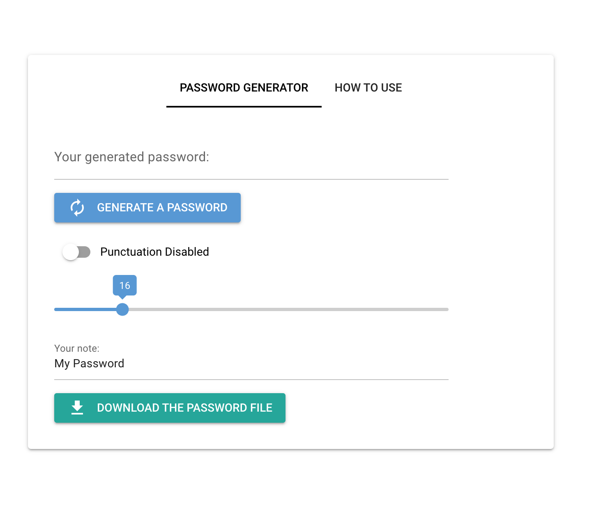

# Simple Password Generator with NiceGUI Framework

---

# nicegui-password-generator

This app is a simple password generator made with the [NiceGUI Framework](https://nicegui.io/).
You can download a text file once you generated a password. The text file won't be stored in the computer.

## Technologies Used

- Python

## Usage

- Tap the "GENERATE A PASSWORD" button to generate a random password.
- The generated password can be altered as you like from the input.
- Optionally, you can enable the "punctuation enabled" switch to include punctuation in the password.
- You can also change the length of the password by moving the slider.
- You can add a note of the password by changing the text in the "Your note:" input.
- Tap the "DOWNLOAD THE PASSWORD FILE" button to download a text file containing the password and the note.

## Visuals

